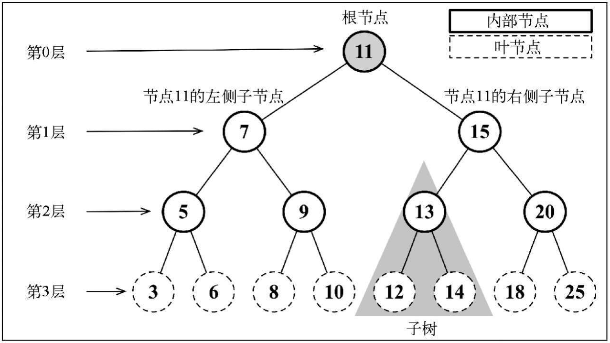
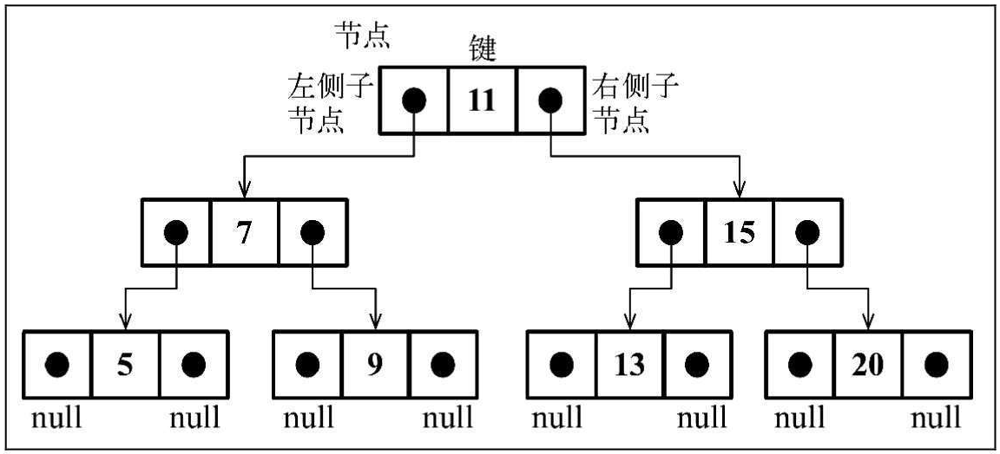
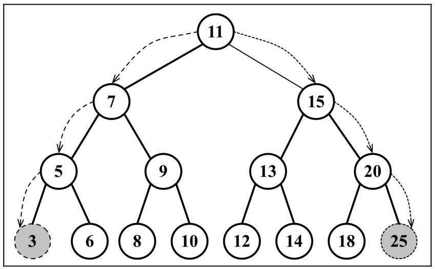

## JavaScript数据结构之树
一个树结构包含一系列存在父子关系的节点。每个节点都有一个父节点（除了顶部的第一个节点）以及零个或多个子节点：

<div align="center"></div>

位于树顶部的节点叫作根节点（11）。它没有父节点。树中的每个元素都叫作节点，节点分为内部节点和外部节点。至少有一个子节点的节点称为内部节点（7、5、9、15、13和20是内部节点）。没有子元素的节点称为外部节点或叶节点（3、6、8、10、12、14、18和25是叶节点）。

一个节点可以有祖先和后代。一个节点（除了根节点）的祖先包括父节点、祖父节点、曾祖父节点等。一个节点的后代包括子节点、孙子节点、曾孙节点等。例如，节点5的祖先有节点7和节点11，后代有节点3和节点6。

有关树的另一个术语是子树。子树由节点和它的后代构成。例如，节点13、12和14构成了上图中树的一棵子树。

节点的一个属性是深度，节点的深度取决于它的祖先节点的数量。比如，节点3有3个祖先节点（5、7和11），它的深度为3。

树的高度取决于所有节点深度的最大值。一棵树也可以被分解成层级。根节点在第0层，它的子节点在第1层，以此类推。上图中的树的高度为3（最大高度已在图中表示——第3层）。

以上是关于树的一些概念，下面我们以二叉树为主要对象，构建一个二叉树数据结构。

### 二叉树
下面我们来创建一个二叉树，以及他的一些内置方法

#### 创建二叉树
首先一颗二叉树由若干个节点组成，节点可表示为如下
```js
class Node {
  constructor(key) {
    this.key = key // 节点键值
    this.left = null // 左孩子
    this.right = null // 右孩子
  }
}
```
下图展现了二叉搜索树数据结构的组织方式。

<div align="center"></div>

和链表一样，我们将通过指针（引用）来表示节点之间的关系（树相关的术语称其为边）。在双向链表中，每个节点包含两个指针，一个指向下一个节点，另一个指向上一个节点。对于树，使用同样的方式（也使用两个指针），但是一个指向左侧子节点，另一个指向右侧子节点。因此，将声明一个Node类来表示树中的每个节点。

下面，我们会声明BinarySearchTree类的基本结构。
```js
class BinarySearchTree {
  constructor() {
    this.root = null
  }
}
```
然后，我们需要实现一些方法。下面是将要在BinarySearchTree类中实现的方法。  
``❑ insert(key)：向树中插入一个新的键。``  
``❑ search(key)：在树中查找一个键。如果节点存在，则返回true；如果不存在，则返回false。``  
``❑ inOrderTraverse()：通过中序遍历方式遍历所有节点。``  
``❑ preOrderTraverse()：通过先序遍历方式遍历所有节点。``  
``❑ postOrderTraverse()：通过后序遍历方式遍历所有节点。``  
``❑ min()：返回树中最小的值/键。``  
``❑ max()：返回树中最大的值/键。``  
``❑ remove(key)：从树中移除某个键。``  

#### insert(key)
要向树中插入一个新的节点（或键），要经历三个步骤。

第一步是验证插入操作是否是特殊情况。对于二叉搜索树的特殊情况是，我们尝试插入的树节点是否为第一个节点。如果是，我们要做的就是创建一个Node类的实例并将它赋值给root属性来将root指向这个新节点。

第二步是将节点添加到根节点以外的其他位置。在这种情况下，我们需要一个辅助方法来帮助我们做这件事，它的声明如下。
```js
insertNode(node,key) {
  if(node.key > key) {
    if(node.left) {
      this.insertNode(node.left,key)
    } else {
      node.left = new Node(key)
    }
  } else {
    if(node.right) {
      this.insertNode(node.right,key)
    } else {
      node.right = new Node(key)
    }
  }
}
```
如果新节点的键小于当前节点的键，那么需要检查当前节点的左侧子节点。如果它没有左侧子节点，就在那里插入新的节点。如果有左侧子节点，需要通过递归调用insertNode方法继续找到树的下一层。在这里，下次要比较的节点将会是当前节点的左侧子节点（左侧节点子树）。

如果节点的键比当前节点的键大，同时当前节点没有右侧子节点，就在那里插入新的节点。如果有右侧子节点，同样需要递归调用insertNode方法，但是要用来和新节点比较的节点将会是右侧子节点（右侧节点子树）。

**最后 insert 方法如下**
```js
insert(key) {
  if(!this.root) { // 判断是否为空二叉树
    this.root = new Node(key)
  } else { // 不为空
    this.insertNode(this.root,key) // 调用insertNode插入节点
  }
}
insertNode(node,key) {
  if(node.key > key) {
    if(node.left) {
      this.insertNode(node.left,key)
    } else {
      node.left = new Node(key)
    }
  } else {
    if(node.right) {
      this.insertNode(node.right,key)
    } else {
      node.right = new Node(key)
    }
  }
}
```

### 二叉树的遍历
遍历一棵树是指访问树的每个节点并对它们进行某种操作的过程。但是我们应该怎么去做呢？应该从树的顶端还是底端开始呢？从左开始还是从右开始呢？访问树的所有节点有三种方式：中序、先序和后序。

> 为什么叫前序、后序、中序?

>一棵二叉树由根结点、左子树和右子树三部分组成，若规定 D、L、R 分别代表遍历根结点、遍历左子树、遍历右子树，则二叉树的遍历方式有 6 种：DLR、DRL、LDR、LRD、RDL、RLD。由于先遍历左子树和先遍历右子树在算法设计上没有本质区别，所以，只讨论三种方式：
>DLR--前序遍历（根在前，从左往右，一棵树的根永远在左子树前面，左子树又永远在右子树前面 ）
>LDR--中序遍历（根在中，从左往右，一棵树的左子树永远在根前面，根永远在右子树前面）
>LRD--后序遍历（根在后，从左往右，一棵树的左子树永远在右子树前面，右子树永远在根前面）

#### inOrderTraverse() 中序遍历
中序遍历是一种以上行顺序访问BST所有节点的遍历方式，也就是以从最小到最大的顺序访问所有节点。中序遍历的一种应用就是对树进行排序操作。我们来看看它的实现。
```js
// 中序遍历
inOrderTraverse(callback) {
  this.inOrderTraverseNode(this.root,callback)
}
```
inOrderTraverse方法接收一个回调函数作为参数。回调函数用来定义我们对遍历到的每个节点进行的操作。由于我们在BST中最常实现的算法是递归，这里使用了一个辅助方法，来接收一个节点和对应的回调函数作为参数。辅助方法如下所示。

```js
inOrderTraverseNode(node,callback) {
  if(node) {
    inOrderTraverseNode(node.left,callback)
    callback && callback(node.key)
    inOrderTraverseNode(node.right,callback)
  }
}
```
要通过中序遍历的方法遍历一棵树，首先要检查以参数形式传入的节点是否为null（这就是停止递归继续执行的判断条件，即递归算法的基线条件）。然后，递归调用相同的函数来访问左侧子节点。接着对根节点进行一些操作（callback），然后再访问右侧子节点。

#### preOrderTraverse() 先序遍历
先序遍历是以优先于后代节点的顺序访问每个节点的。先序遍历和中序遍历的不同点是，先序遍历会先访问节点本身，然后再访问它的左侧子节点，最后是右侧子节点。
```js
// 先序遍历
preOrderTraverse(callback) {
  this.preOrderTraverseNode(this.node,callback)
}
preOrderTraverseNode(node,callback) {
  if(node) {
    callback && callback(node.key)
    this.preOrderTraverseNode(node.left)
    this.preOrderTraverseNode(node.right)
  }
}
```

#### preOrderTraverse() 先序遍历
后序遍历是先访问节点的后代节点，再访问节点本身。后序遍历会先访问左侧子节点，然后是右侧子节点，最后是父节点本身。
```js
// 后序遍历
postOrderTraverse(callback) {
  this.postOrderTraverseNode(this.root,callback)
}
postOrderTraverseNode(node,callback) {
  this.postOrderTraverseNode(node.left,callback)
  this.postOrderTraverseNode(node.right,callback)
  callback && callback(node.key)
}
```

### 搜索二叉树中的值

#### search(key) 搜索一个特定的值

算法实现如下

```js
// search
search(key) {
  return this.searchNode(this.root,key)
}
searchNode(node,key) {
  if(node) {
    if(node.key === key) {
      return true
    } else if(node.key > key) {
      this.searchNode(node.left,key)
    }else {
      this.searchNode(node.right,key)
    }
  } else {
    return false
  }
}
```
searchNode方法可以用来寻找一棵树或其任意子树中的一个特定的值。这也是为什么在 search 中调用它的时候传入树的根节点作为参数。
在开始算法之前，要验证作为参数传入的node是否合法（不是null或undefined）。如果是的话，说明要找的键没有找到，返回false。
如果传入的节点不是null，需要继续验证。如果要找的键比当前的节点小，那么继续在左侧的子树上搜索。如果要找的键比当前的节点大，那么就从右侧子节点开始继续搜索（行{6}），否则就说明要找的键和当前节点的键相等，返回true来表示找到了这个键。

#### min() 搜索最小值
我们使用下面的树作为示例。

<div align="center"></div>

如果你看一眼树最后一层最左侧的节点，会发现它的值为3，这是这棵树中最小的键。如果你再看一眼树最右端的节点（同样是树的最后一层），会发现它的值为25，这是这棵树中最大的键。这是由于我们在构建二叉树的时候，将最小值插入了最左边，最大值插入了最右边，所以可以通过二叉树最后一层的最左边叶子结点和最右边叶子结点找到最小值和最大值。

代码实现如下：

```js
min() {
  let curr = this.root
  while(curr && curr.left) {
    curr = curr.left
  }
  return curr
}
```

#### max() 搜索最大值。
以和 ``min`` 相似的方式，可以实现``max``方法。

代码实现如下：

```js
max() {
  let curr = this.root
  while(curr && curr.right) {
    curr = curr.right
  }
  return curr
}
```
### 移除节点
#### remove(key) 移除一个节点

为了实现``remove``方法,使用了一个辅助方法``removeNode``,removeNode方法较为复杂，因为在移除节点的时候会出现几种情况，分别为：待移除的节点没有子节点、只有一个子节点、有两个子节点。

代码实现如下：
```js
remove(key) {
  this.root = removeNode(this.root,key)
}
removeNode(node,key) {
  if(!node) return null
  if(node.key > key) {
    node.left = this.removeNode(node.left,key)
  }else if(node.key < key) {
    node.right = this.removeNode(node.right,key)
  }else { // 查找到待删除节点
    // situation 1
    if(!node.left && !node.right) { // 待删除节点没有子节点
      node = null
      return node
    }
    // situation 2
    if(!node.left){ // 待删除节点只有右节点
      node = node.right
      return node
    }else if(!node.right) { // 待删除节点只有左节点
      node = node.left
      return node
    }
    // situation 3 待删除节点左右节点都存在
    // 此时为了保证二叉树的结构（左子树的值永远小于右子树）,我们需要将待删除节点的右子树key最小的节点值替换给待删除节点，然后将该最小值的节点删除
    let minNode = node.right
    while(minNode.left) {
      minNode = minNode.left // 查找待删除节点右子树中最小节点
    }
    node.key = minNode.key // 替换节点值
    node.right = this.removeNode(node.right,minNode.key) // 删除右子树中最小节点
    return node
  }
}
```

### 以上就是我对于二叉树的总结