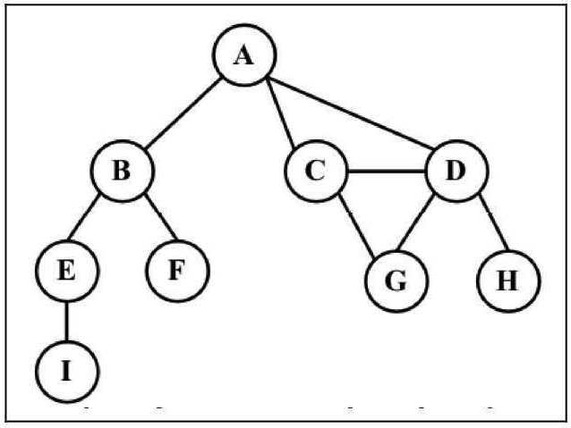
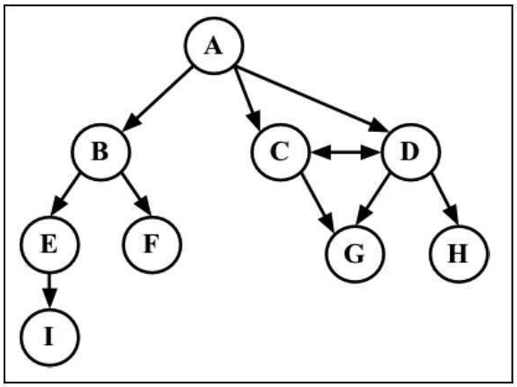
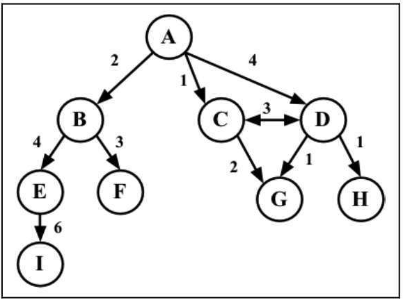
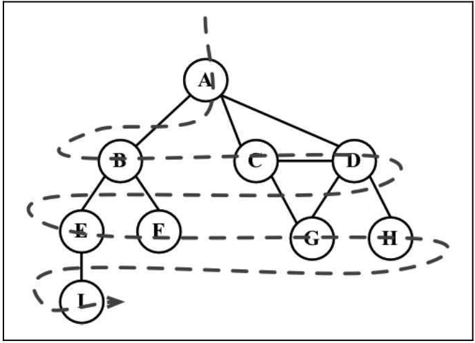
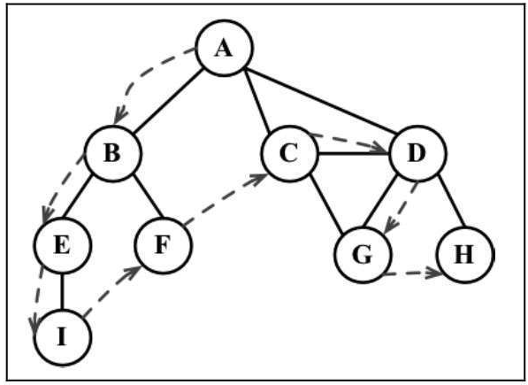

# JavaScript数据结构之图

### 图的相关术语

下图表示一个图：


* **相邻顶点** ： 由一条边连接在一起的顶点称为相邻顶点。比如，A和B是相邻的，A和D是相邻的，A和C是相邻的，A和E不是相邻的。
* **度** ： 一个顶点的度是其相邻顶点的数量。比如，A和其他三个顶点相连接，因此A的度为3; E和其他两个顶点相连，因此E的度为2。
* **路径** ： 路径是顶点v 1, v2,…, vk的一个连续序列，其中vi和vi+1是相邻的。以上一示意图中的图为例，其中包含路径A B E I和A C D G。
* **简单路径** ： 简单路径要求不包含重复的顶点。举个例子，A D G是一条简单路径。除去最后一个顶点（因为它和第一个顶点是同一个顶点），环也是一个简单路径，比如A D C A（最后一个顶点重新回到A）。
* **无环｜连通** ： 如果图中不存在环，则称该图是无环的。如果图中每两个顶点间都存在路径，则该图是连通的。
* **有向图和无向图** ： 图可以是无向的（边没有方向）或是有向的（有向图）。如下图所示，有向图的边有一个方向。

* **强连通** ：如果图中每两个顶点间在双向上都存在路径，则该图是强连通的。例如，C和D是强连通的，而A和B不是强连通的。
* **权** ： 图还可以是未加权的（目前为止我们看到的图都是未加权的）或是加权的。如下图所示，加权图的边被赋予了权值。


### 图的表示方式
1. **邻接矩阵**
2. **邻接表**
3. **关联矩阵**
### 创建Graph类
```js
Class Graph{
    constructor(isDirected = false) {
        this.isDirected = isDirected // 是否有向
        this.vertices = [] // 顶点列表
        this.adjList = new Map() // 用 Map 对象保存邻接表
    }
    // 添加顶点
    addVertex(v) {
        if(!this.vertices.includes(v)) {
            this.vertices.push(v)
            this.adjList.set(v,[])
        }
    }
    // 连接顶点
    addEdge(v,w) {
        if(!this.adjList.get(v)) { // 判断是否存在v顶点
            this.addVertex(v) // 不存在则创建
        }
        if(!this.adjList.get(w)) { // 判断是否存在w顶点
            this.addVertex(w) // 不存在则创建
        }
        this.adjList.get(v).push(w) // 将w放入v的相邻顶点中
        if(!this.isDirected)  { // 如果是无向图
            this.adjList.get(w).push(v) // 则同时需要将v放入w的相邻顶点中
        }
    }
    // 获取顶点
    getVertices() {
        return this.vertices
    }
    // 获取顶点邻接表
    getAdjList() {
        return this.adjList
    }
    // toString 返回图
    // A -> B C D
    // B -> A C
    // C -> A B
    // D -> A
    toString() {
        let s = ''
        for(let i = 0; i < this.vertices.length; i++) {
            s = s + `${this.vertices[i]} ->`
            this.adjList.get(this.vertices[i]).map(vertex => {
                s = s + ` ${vertex}`
            })
            s = s + '\n'
        }
        return s
    }
}
```

### 图的遍历

和树数据结构类似，我们可以访问图的所有节点。有两种算法可以对图进行遍历：`广度优先搜索（breadth-first search, BFS）`和`深度优先搜索（depth-first search, DFS）`。图遍历可以用来寻找特定的顶点或寻找两个顶点之间的路径，检查图是否连通，检查图是否含有环，等等。

在实现算法之前，让我们来更好地理解一下图遍历的思想。

图遍历算法的思想是必须追踪每个第一次访问的节点，并且追踪有哪些节点还没有被完全探索。对于两种图遍历算法，都需要明确指出第一个被访问的顶点。

完全探索一个顶点要求我们查看该顶点的每一条边。对于每一条边所连接的没有被访问过的顶点，将其标注为被发现的，并将其加进待访问顶点列表中。

为了保证算法的效率，务必访问每个顶点至多两次。连通图中每条边和顶点都会被访问到。

#### 广度优先遍历

广度优先搜索算法会从指定的第一个顶点开始遍历图，先访问其所有的邻点（相邻顶点），就像一次访问图的一层。换句话说，就是先宽后深地访问顶点，如下图所示。



以下是从顶点v开始的广度优先搜索算法所遵循的步骤。
1. 创建一个队列Q。
2. 标注v为被发现的（灰色），并将v入队列Q。
3. 如果Q非空，则运行以下步骤：
    * 将u从Q中出队列；
    * 标注u为被发现的（灰色）；
    * 将u所有未被访问过的邻点（白色）入队列；
    * 标注u为已被探索的（黑色）。

```js
// 模拟枚举颜色
const Colors = {
    WHITE: 0,
    GREY: 1,
    BLACK: 2
}
// 初始化顶点颜色
const initializeColor = (vertices) => {
    let colors = {}
    vertices.map(v => {
        colors[v] = Colors.WHITE
    })
    return colors
}
const breadthFirstSearch = (graph,startVertex,cb) => {
    const vertices = graph.getVertices()
    const adjList = graph.getAdjList()
    
    const colors = initializeColor(vertices) // 初始化顶点颜色，使用colors对象保存映射
    const queue = new Queue()
    
    colors[startVertex] = Colors.GREY // 标记起点颜色
    queue.enqueue(startVertex)// 加入队列开始访问

    while(!enqueue.isEmpty()) {
        let u = queue.dequeue() // 队列首节点出队，进行探索
        let neighbors = adjList.get(u)
        neighbors.map(v => { // 检查队列首元素相邻边
            if(colors[v] === Colors.WHITE) { // 如果未被访问 则入队
                colors[v] = Colors.GREY
                queue.enqueue(v)
            }
        })
        colors[u] = Colors.BLACK // 探索完毕，修改顶点为黑色
        cb && cb(u) // 执行回调，操作节点
    }
}
```
以上是通过广度优先算法遍历节点，但是通过这个思想，我们可以处理很多问题，如：计算两点间的距离，计算两点间的最短路径，下面来实现一下。

**通过BFS算法记录两点间距离**
```js
const BFS = (graph,startVertex) => {
    const vertices = graph.getVertices()
    const adjList = graph.getAdjList()
    const distances = {} // 保存每个节点与起始节点的最短距离
    const predecessors = {} // 保存每个节点的溯节点
    const queue = new Queue()

    const colors = initializeColor(vertices) // 初始化顶点颜色，使用colors对象保存映射
    vertices.map(v => { // init distances | predecessors
        distances[v] = 0
        predecessors[v] = null
    })
    colors[startVertex] = Colors.GREY // 标记起点颜色
    queue.enqueue(startVertex)// 加入队列开始访问
    while(!queue.isEmpty()) {
        let u = queue.dequeue()
        let neighbors = adjList.get(u)
        nerghbors.map(v => {
            if(colors[v] === Colors.WHITE) {
                colors[vertex] = Colors.GREY
                distances[vertex] = distances[u] + 1
                predecessors[vertex] = u
                queue.enqueue(vertex)
            }
        })
        colors[u] = Colors.BLACK // 探索完毕，修改顶点为黑色
    }
    return {
        distances,
        predecessors
    }
}
```
在上述的方法中，我们可以通过``BFS``返回的 ``distances`` 和 ``predecessors`` 对象我们可以拿到每个顶点距起点的距离和前溯节点。

通过这两个对象，我们还可以得出节点之间的具体最短路径，我们来实现一下。
```js
const getShortestPath = (graph,v,w) => {
  let result = BFS(graph,v)
  let shortestDistance = result.distances[w]
  let final = w
  let shortestPath = `${final}`
  for(let i = 0; i < shortestDistance; i++) {
    final = result.predecessors[final]
    shortestPath = `${final} -> ` + shortestPath
  }
  return shortestPath
}
```

#### 深度优先遍历

深度优先搜索算法将会从第一个指定的顶点开始遍历图，沿着路径直到这条路径最后一个顶点被访问了，接着原路回退并探索下一条路径。换句话说，它是先深度后广度地访问顶点，如下图所示。



深度优先搜索算法不需要一个源顶点。
在深度优先搜索算法中，若图中顶点v未访问，则访问该顶点v。

要访问顶点v，照如下步骤做：
1. 标注v为被发现的（灰色）；
2. 对于v的所有未访问（白色）的邻点w，访问顶点w；
3. 标注v为已被探索的（黑色）。

> 如你所见，深度优先搜索的步骤是递归的，这意味着深度优先搜索算法使用栈来存储函数调用（由递归调用所创建的栈）。

算法实现如下:
```js
const depthFirstSearchVisit = (vertex,colors,adjList,cb) => {
    if(colors[vertex] === Colors.WHITE) {
        colors[vertex] = GREY
        cb && cb(vertex)
        let neighbors = adjList.get(vertex)
        neighbors.map(v => {
            depthFirstSearchVisit(v,colors,adjList,cb)
        })
        colors[vertex] = Colors.BLACK
    }
}

const depthFirstSearch = (graph,cb) => {
    const vertices = graph.getVertices()
    const adjList = graph.getAdjList()
    const colors = initializeColor(vertices)

    vertices.map(vertex => {
        depthFirstSearchVisit(vertex,colors,adjList,cb)
    })
}
```