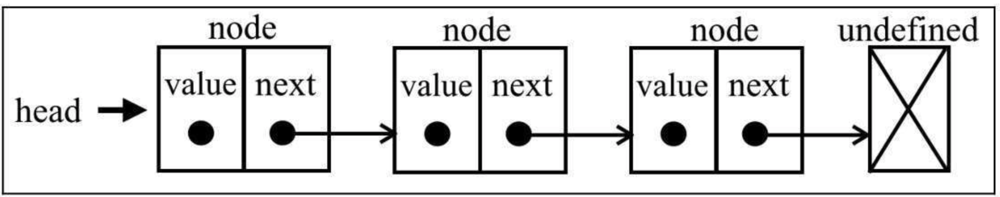

## JavaScript数据结构之链表
要存储多个元素，数组（或列表）可能是最常用的数据结构。这种数据结构非常方便，JS提供了一个便利的[]语法来访问其元素。然而，这种数据结构有一个缺点：（在大多数语言中）数组的大小是固定的，从数组的起点或中间插入或移除项的成本很高，因为需要移动元素。（尽管JavaScript有来自Array类的方法可以帮我们做这些事，但背后的情况同样如此。）
链表存储有序的元素集合，但不同于数组，链表中的元素在内存中并不是连续放置的。每个元素由一个存储元素本身的节点和一个指向下一个元素的引用（也称指针或链接）组成。下图展示了一个链表的结构。

<div align="center"></div>

相对于传统的数组，链表的一个好处在于，添加或移除元素的时候不需要移动其他元素。然而，链表需要使用指针，因此实现链表时需要额外注意。在数组中，我们可以直接访问任何位置的任何元素，而要想访问链表中间的一个元素，则需要从起点（表头）开始迭代链表直到找到所需的元素。

**在Javascript中并不提供链表数据类型，所以我们需要自己根据链表的特性，自行构建。**

---

### 创建链表

```js
// 链表中每个节点的构造函数
function Node(element) {
  this.element = element // 储存节点中的数据
  this.next = null // next指针
}
// 链表构造函数
function LinkedList() {
  this.head = null // 头部指针
  this.length = 0 // 链表长度
}
```

**以上仅仅完成了链表结构的一部分，光靠这些是不能使用的，我们需要为链表结构创建一些方法，完善该数据结构**

**常用的链表方法如下：**
* push(element)：向链表尾部添加一个新元素。
* insert(element, position)：向链表的特定位置插入一个新元素。
* getElementAt(index)：返回链表中特定位置的元素。如果链表中不存在这样的元素，则返回undefined。
* remove(element)：从链表中移除一个元素。
* indexOf(element)：返回元素在链表中的索引。如果链表中没有该元素则返回-1。
* removeAt(position)：从链表的特定位置移除一个元素。
* isEmpty()：如果链表中不包含任何元素，返回true，如果链表长度大于0则返回false。
* size()：返回链表包含的元素个数，与数组的length属性类似。
* toString()：返回表示整个链表的字符串。由于列表项使用了Node类，就需要重写继承自JavaScript对象默认的toString方法，让其只输出元素的值。

**下面我们来一一实现这些方法**

##### LinkedList.push()
```javascript
LinkedList.prototype.push = function(element) {
  let node = new Node(element) // 传入element，建立待插入node
  if(this.head === null) { // 当链表为空时
    this.head = node // 直接将node插入，修改当前 head 指向新建立的 node 元素
  } else { // 当链表不为空
    let current = this.head // 新建指针，指向头部
    while( current.next !== null ) { // 遍历当前链表，找到最后当前链表最后一个元素
      current = current.next
    }
    current.next = node // 将当前链表最后一个元素 next 指针指向新建立的 node 元素
  }
  this.length++ // 递增链表长度
}
```
> 通过下图可以直观的理解以上代码

**situation 1（当前链表为空时）**

向空列表添加一个元素。当我们创建一个LinkedList对象时，head会指向null

<div align="center"></div>

如果head元素为null，就意味着在向链表添加第一个元素。因此要做的就是让head元素指向node元素。下一个node元素会自动成为null。

**situation 2（当前链表不为空时）**

要向链表的尾部添加一个元素，首先需要找到最后一个元素。记住，我们只有第一个元素的引用，因此需要循环访问列表，直到找到最后一项。为此，我们需要一个指向链表中current项的变量。在循环访问链表的过程中，当current.next元素为null时，我们就知道已经到达链表尾部了。然后要做的就是让当前（也就是最后一个）元素的next指针指向想要添加到链表的节点。

<div align="center"></div>

**最后，递增链表的长度，这样就能控制它并且轻松得到链表的长度。**

#### LinkedList.removeAt(position)
```javascript
LinkedList.prototype.removeAt = function(position) {
  if(position >= 0 && position < this.length) { // 判断position是否越界
    let current = this.head
    if(position === 0) { // 当删除第一个节点时，改变头指针，指向下一个节点
      this.head = current.next  
    } else {
      let previous 
      for(let i = 0; i < position; i++) {
        previous = current // 保存待删除节点上一个节点
        current = current.next // 指向当前节点
      }
      previous.next = current.next // 删除节点
    }
    this.length-- // 递减链表长度
    return current.data // 返回删除节点数据
  }
  return null // 越界返回null
}
```
> 通过下图可以直观的理解以上代码

**situation 1（当前删除第一个节点时）**
如果想移除第一个元素，要做的就是让head指向列表的第二个元素。我们将用current变量创建一个对链表中第一个元素的引用。这样current变量就是对链表中第一个元素的引用。如果把head赋为current.next，就会移除第一个元素。
<div align="center"></img></div>

**situation 2（当前删除第一个节点时）**
如果我们要移除链表的最后一个或者中间某个元素。为此，需要迭代链表的节点，直到到达目标位置。一个重要细节是：current变量总是为对所循环列表的当前元素的引用。我们还需要一个对当前元素的前一个元素的引用，它被命名为previous。在迭代到目标位置之后，current变量会持有我们想从链表中移除的节点。因此，要从链表中移除当前元素，要做的就是将previous.next和current.next链接起来。这样，当前节点就会被丢弃在计算机内存中，等着被垃圾回收器清除。
<div align="center"></img><p>删除最后一个元素</p></div>
<div align="center"></img><p>删除中间元素</p></div>

**最后，递减链表的长度。**

#### LinkedList.insert(element,position)
```js
LinkedList.prototype.insert = function(element,position) {
  let node = new Node(element) // 创建新节点
  if(position >=0 && position <= this.length) { // 判断越界
    let current = this.head // 创建current指针，指向头节点
    if(position === 0) { // 当在起点添加元素
      this.head = node // 改变头指针
      node.next = current // 插入新元素
    } else { // 在中间或尾部插入元素
      let previous // 保存待插入位置的前一个元素
      for(let i = 0; i < position; i++) {
        previous = current 
        current = current.next
      }
      previous.next = node // 指向新元素
      node.next = current // 链接 current
    }
    this.length++ // 递增链表长度
    return ture
  }
  return false
}
```
> 通过下图可以直观的理解以上代码

**situation 1（在链表的起点添加一个元素）**
current变量是对链表中第一个元素的引用，我们需要做的是把node.next的值设为current。现在head和node.next都指向了current。接下来要做的就是把head的引用改为node，这样链表中就有了一个新元素。
<div align="center"></img></div>

**situation 2（在链表中间或尾部添加一个元素）**
首先，我们需要迭代链表，找到目标位置。这个时候，我们会循环至index -1的位置，表示需要添加新节点位置的前一个位置。当跳出循环时，previous将是对想要插入新元素的位置之前一个元素的引用，current变量将是我们想要插入新元素的位置之后一个元素的引用。在这种情况下，我们要在previous和current之间添加新元素。因此，首先需要把新元素（node）和当前元素链接起来，然后需要改变previous和current之间的链接。我们还需要让previous.next指向node，取代current。
<div align="center"></img></div>

**最后，递增链表的长度。**

#### LinkList.getElementAt(index)
```js
LinkList.prototype.getElementAt = function(index) {
  if(index >= 0 && index < this.length) { // 判断是否越界
    let current = this.head
    if(index > 0) {
      for(let i = 0; i < index; i++) {
        current = current.next // 指向待查找元素
      }
    }
    return current.data // 返回查找结果
  }
  return null
}
```

#### LinkList.indexOf(element)
```js
LinkList.prototype.indexOf = function(element) {
  let current = this.head
  for(let i = 0; i < this.length; i++) {
    if(current.data == element) {
      return i
    }
    current = current.next
  }
  return -1
}
```

#### LinkList.remove(element)
```js
LinkList.prototype.remove = function(element) {
  let index = this.indexOf(element)
  return this.removeAt(index)
}
```

#### LinkList.size()
```js
LinkList.prototype.size = function() {
  return this.length
}
```

#### LinkList.isEmpty()
```js
LinkList.prototype.isEmpty = function() {
  return this.length ? false : true
}
```

#### LinkList.toString()
```js
LinkList.prototype.toString = function() {
  if(!this.length) { // 链表为空时
    return '' // 返回空字符串
  } else {
    let current = this.head
    let objString = ''
    while(current.next !== null) { // 遍历链表
      objString = objString + current.data + ',' // 将每个元素转成字符串
      current = current.next
    }
    objString = objString + current.data
    return objString // 返回链表字符串
  }
}
```

### **以上就是我关于JS数据结构单链表的总结**